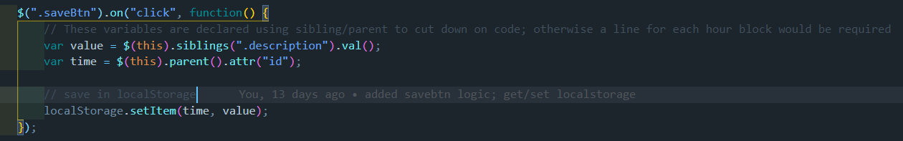

# hw5scheduler

This project was not fundamentally difficult. It is a basic exercise in using [MomentJS](https://momentjs.com/), JQuery and localStorage. I adjusted it to make it more relevant for the current climate (Coronavirus). Working from home has made sticking to a schedule remarkably difficult for me. For that reason, I felt a schedule that account for all 24 hours of the day would be more apropos. For aesthetic reasons, the scrollbar is hidden, but the whole timeblocks div is scrollable and accounts for all 24 hours of a day. I tried to implement a scrollspy that would automatically go to the timeblock with the `.present` class, but was unsuccessful. Since the div does not loop (and implementing that is a hassle), it currently snaps to somewhere around the present timeblock.  


Despite this project's relative simplicity, there are some cool tricks implemented to cutdown on the amount of code. For example:

*  This was a cool way of not writing the same logical function for all 24 timeblocks.
* In order to refactor the timeblocks section, I abused the Emmet shortcuts. The glut of the html was written with something like this:
    ```
    (div#hour-$$.row.time-block>div.col-md-1.hour>textarea.description>button.btn>i.fas.fa-save)*24
    ```
    This obviously cut down on the number of keystrokes, and made it a lot easier to generate 24 timeblocks. The `$` in the hour id is dynamic and matches up with the multiplier at the end. 

Despite the simplicity of this project, one difficulty was making this page responsive. It is not currently optimized for small phone sized screens, but this is something I will likely address at a later time. 

Ultimately, the main focus of this project was becoming familiar with [MomentJS](https://momentjs.com/) and getting comfortable reading documentation. I appreciated how easy it made some of the components, and I shudder to think of how this would be built using `new Date` or something like it.


